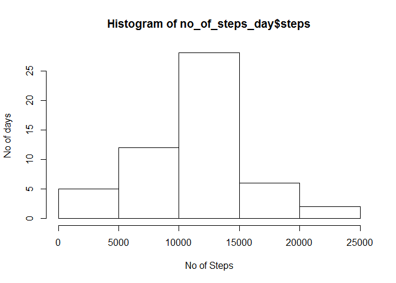
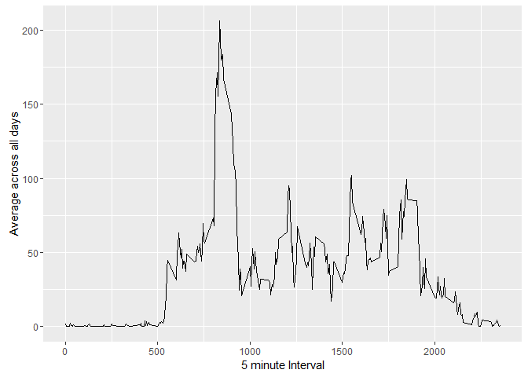
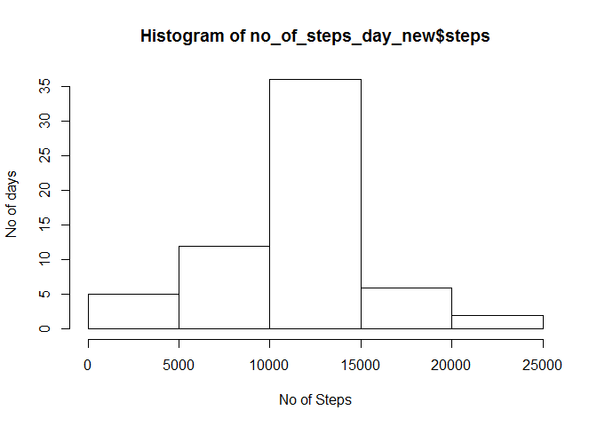
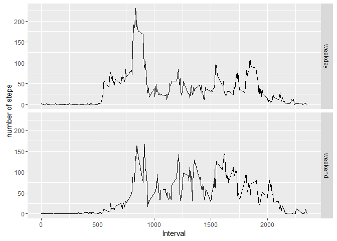

# Reproducible Research: Peer Assessment 1


## Loading and preprocessing the data

```r
unzip("activity.zip")
data1 <- read.csv("activity.csv")
```


## What is mean total number of steps taken per day?

```r
no_of_steps_day<-aggregate(steps~date,data1,sum)
hist(no_of_steps_day$steps,xlab = 'No of Steps',ylab = 'No of days')
```

\

```r
cat("The mean is",mean(no_of_steps_day$steps))
```

```
## The mean is 10766.19
```

```r
cat("The median is",median(no_of_steps_day$steps))
```

```
## The median is 10765
```


## What is the average daily activity pattern?

```r
library(ggplot2)
```

```
## Warning: package 'ggplot2' was built under R version 3.2.3
```

```r
step_per_5_min <- aggregate(steps ~ interval,data1,mean)
g <- ggplot(step_per_5_min,aes(interval,steps)) + labs(x="5 minute Interval",y="Average across all days")
g + geom_line()
```

\

```r
cat("5 minute interval with max steps",step_per_5_min[which(step_per_5_min$steps==max(step_per_5_min$steps)),]$interval)
```

```
## 5 minute interval with max steps 835
```


## Imputing missing values
First we merge the data1(the orignal data that we read) and step_per_5_min(the data frame having 5 min average for steps taken acroos all days). After Merging we will get the missing values for Steps.
Once we get the missing values for steps we are going to use the new dataset to plot histogram,mean and averages as asked in the problem.

```r
temp1 <- merge(data1,step_per_5_min,by = "interval",sort = FALSE)
temp1[which(is.na(temp1$steps.x)),]$steps.x=temp1[which(is.na(temp1$steps.x)),]$steps.y
DataClean<-subset(temp1,select = c(1,2,3))
names(DataClean)[2]='steps'
```
So the new dataset dataclean is same as the orignal data set along with the missing data as well.


```r
no_of_steps_day_new<-aggregate(steps~date,DataClean,sum)
hist(no_of_steps_day_new$steps,xlab = 'No of Steps',ylab = 'No of days')
```

\

```r
cat("The new mean is",mean(no_of_steps_day_new$steps))
```

```
## The new mean is 10766.19
```

```r
cat("The new median is",median(no_of_steps_day_new$steps))
```

```
## The new median is 10766.19
```

```r
# and the old mean are
cat("The old  mean is",mean(no_of_steps_day$steps))
```

```
## The old  mean is 10766.19
```

```r
cat("The old median is",median(no_of_steps_day$steps))
```

```
## The old median is 10765
```
So it is quite clear that after imputing the missing values there is no change in the mean. While there is a slight change in the median. Additionally there is a slight chenge in the total no of steps per day for the number of days. Now from the histogram we can see that y-axis range increases to 35 days now

## Are there differences in activity patterns between weekdays and weekends?

First, let's find the day of the week for each measurement in the dataset. In this part, we use the dataset with the filled-in values.


```r
DataClean$Dayname <- weekdays(as.Date(DataClean$date))
DataClean$Dayname <- as.factor(DataClean$Dayname)
levels(DataClean$Dayname) <- list(weekday = c("Monday","Thursday","Tuesday","Wednesday","Friday"), weekend = c("Saturday","Sunday"))
```
Now, let's make a panel plot containing plots of average number of steps taken on weekdays and weekends.


```r
averages <- aggregate(steps ~ interval + Dayname,DataClean,mean)
ggplot(averages,aes(interval,steps))+labs(x="Interval",y="number of steps") + facet_grid(Dayname~.) + geom_line()
```

\
